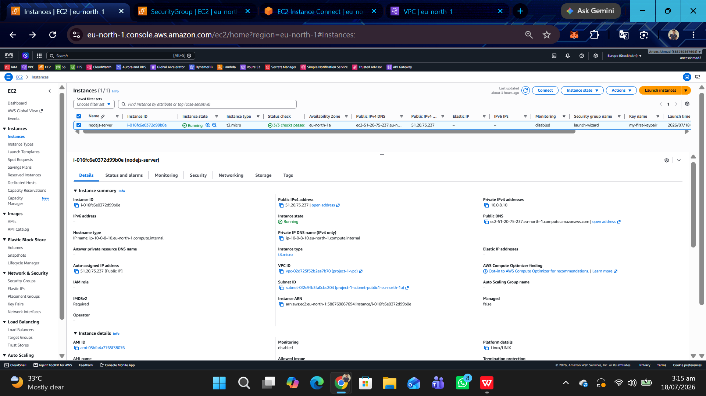
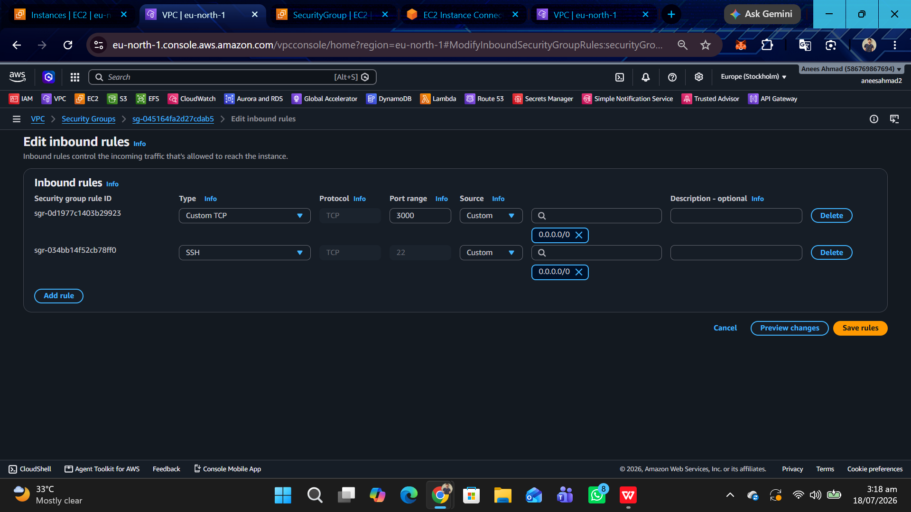
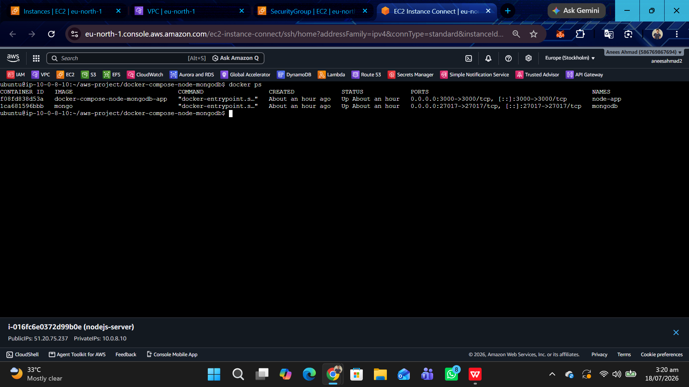
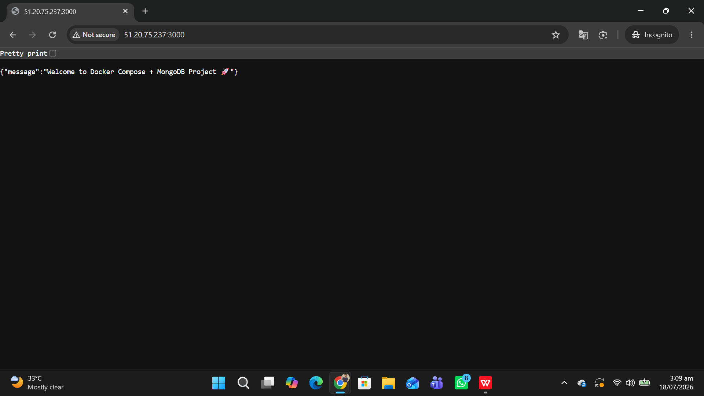
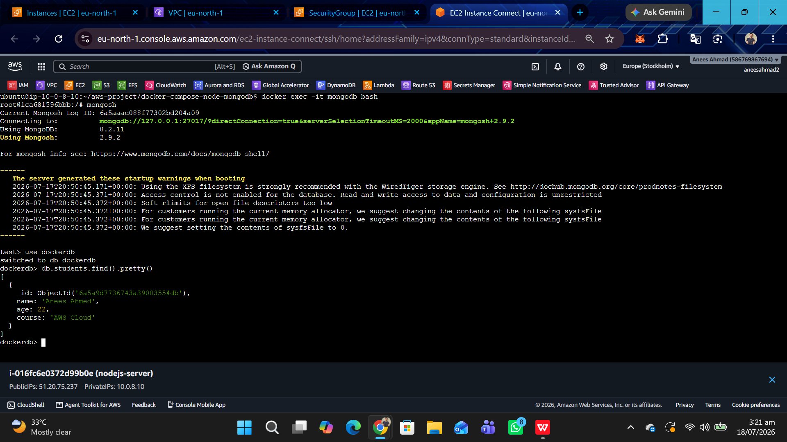

# 🚀 AWS EC2 Docker Node.js MongoDB Deployment

A real-world cloud deployment project demonstrating how to deploy a Node.js application with MongoDB on an AWS EC2 Ubuntu server using Docker and Docker Compose.

---

# 📌 Project Overview

This project demonstrates how to deploy a multi-container application on **AWS EC2** using **Docker Compose**.

The application consists of:

- Node.js
- Express.js
- MongoDB
- Docker
- Docker Compose
- AWS EC2 (Ubuntu 24.04)

The Node.js application runs inside a Docker container and connects to a MongoDB container using Docker Compose networking.

---

# ☁️ AWS Architecture

```
                 Internet
                     │
                     ▼
          AWS EC2 (Ubuntu 24.04)
                     │
              Docker Engine
                     │
             Docker Compose
             ┌────────┴────────┐
             │                 │
             ▼                 ▼
       Node.js App        MongoDB
      (Port 3000)      (Port 27017)
```

---

# 🛠 Technologies Used

- AWS EC2
- Ubuntu 24.04
- Docker
- Docker Compose
- Node.js
- Express.js
- MongoDB
- Mongoose
- Git
- GitHub
- Linux

---

# 📂 Project Structure

```
aws-ec2-docker-nodejs/
│
├── Dockerfile
├── docker-compose.yml
├── app.js
├── package.json
├── package-lock.json
├── models/
│   └── Student.js
├── README.md
└── screenshots/
    ├── ec2-running.png
    ├── security-group.png
    ├── docker-containers.png
    ├── browser-output.png
    └── mongodb-data.png
```

---

# 🚀 Deployment Steps

## 1. Clone Repository

```bash
git clone https://github.com/aneesahmad081/aws-ec2-docker-nodejs.git
```

## 2. Go to Project Folder

```bash
cd aws-ec2-docker-nodejs
```

## 3. Build and Start Containers

```bash
docker compose up --build -d
```

## 4. Verify Running Containers

```bash
docker ps
```

## 5. Access Application

```
http://YOUR_PUBLIC_IP:3000
```

Example:

```
http://51.20.75.237:3000
```

---

# 📌 API Endpoints

## Home

```http
GET /
```

Response

```json
{
  "message": "Welcome to Docker Compose + MongoDB Project 🚀"
}
```

## Create Student

```http
POST /student
```

Request Body

```json
{
  "name": "Anees Ahmad",
  "age": 22,
  "course": "AWS Cloud"
}
```

## Get All Students

```http
GET /students
```

---

# 🐳 Useful Docker Commands

Build & Run

```bash
docker compose up --build -d
```

Stop Containers

```bash
docker compose down
```

Restart Containers

```bash
docker compose restart
```

Running Containers

```bash
docker ps
```

View Logs

```bash
docker compose logs
```

Enter MongoDB Container

```bash
docker exec -it mongodb bash
```

Open Mongo Shell

```bash
mongosh
```

---

# 🍃 MongoDB Commands

Show Databases

```javascript
show dbs
```

Use Database

```javascript
use dockerdb
```

Show Collections

```javascript
show collections
```

Insert Student

```javascript
db.students.insertOne({
  name: "Anees Ahmad",
  age: 22,
  course: "AWS Cloud"
})
```

View Students

```javascript
db.students.find().pretty()
```

---

# 📷 Project Screenshots

<table>
<tr>
<td align="center">

<b>AWS EC2 Running</b><br><br>



</td>

<td align="center">

<b>Security Group</b><br><br>



</td>
</tr>

<tr>
<td align="center">

<b>Docker Containers</b><br><br>



</td>

<td align="center">

<b>Application Running</b><br><br>



</td>
</tr>

<tr>
<td colspan="2" align="center">

<b>MongoDB Data</b><br><br>



</td>
</tr>
</table>

---

# 📚 Learning Outcomes

After completing this project, I learned:

- AWS EC2 Instance Management
- Linux Commands
- SSH into EC2
- Docker Installation
- Docker Compose
- Docker Images
- Docker Containers
- Docker Networking
- Docker Volumes
- MongoDB Container
- Git & GitHub
- Node.js Deployment
- Cloud Deployment

---

# 🎯 Future Improvements

- Nginx Reverse Proxy
- HTTPS (SSL/TLS)
- GitHub Actions CI/CD
- AWS Elastic IP
- AWS Load Balancer
- Domain Name Integration

---

# 👨‍💻 Author

**Anees Ahmad**

Cloud & AWS Enthusiast

GitHub: https://github.com/aneesahmad081
